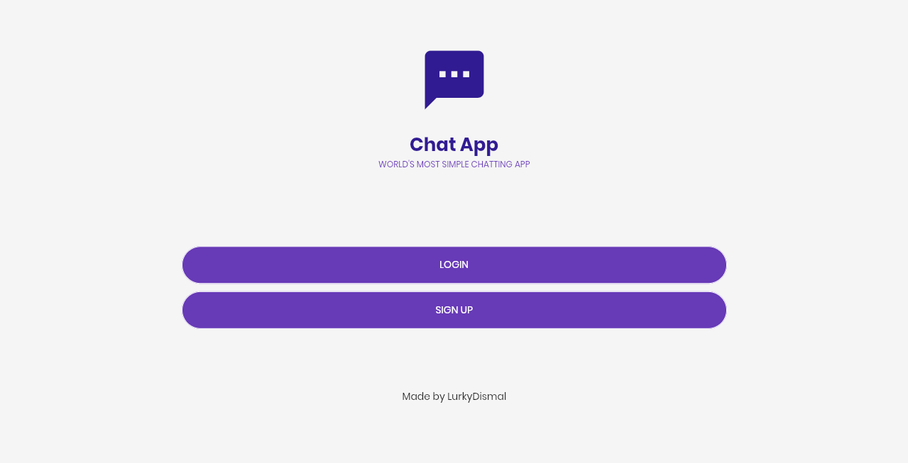

# chat_app

> A simple chat application.

## Table of Contents

* [Technologies Used](#technologies-used)
* [Features](#features)
* [Screenshots](#screenshots)
* [Setup](#setup)
* [Project Status](#project-status)
* [Room for Improvement](#room-for-improvement)
* [Acknowledgements](#acknowledgements)
* [License](#license)

## Technologies Used

* animated_text_kit - version latest
* edge_alerts - version 0.0.1
* modal_progress_hud_nsn - version 0.3.0
* cupertino_icons - version 1.0.2
* http - version 0.13.5

## Features

* Basic text messanger functionality.
* All platforms support.

## Screenshots

## Setup

Edit **relay/db_connection.php** to follow your data.  
Copy **relay/** contents to your host.  
Edit **lib/config.dart** to follow your data.  
Create database using **relay/chat_app.sql**.

## Project Status

Project is: _in progress_.

## Room for Improvement

Room for improvement:

* Improve code quality.
* Improve UX.
* Improve design.
* Lazy load messages.

To do:

* Colors based on theme.
* Attachments in messages.
* Add unit tests.
* Add widget tests.

## Acknowledgements

* This project was inspired by [Telegram](https://telegram.org/).
* This project was based on [@evgfilim1/ftg](https://github.com/evgfilim1/ftg).

## License

This project is open source and available under the [WTFPL license](LICENSE).
